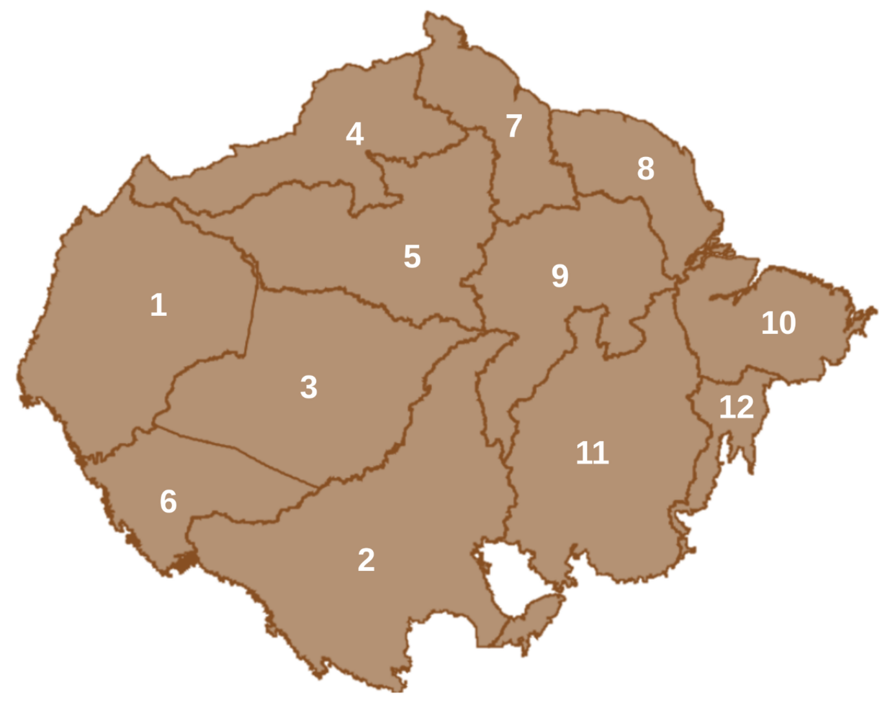
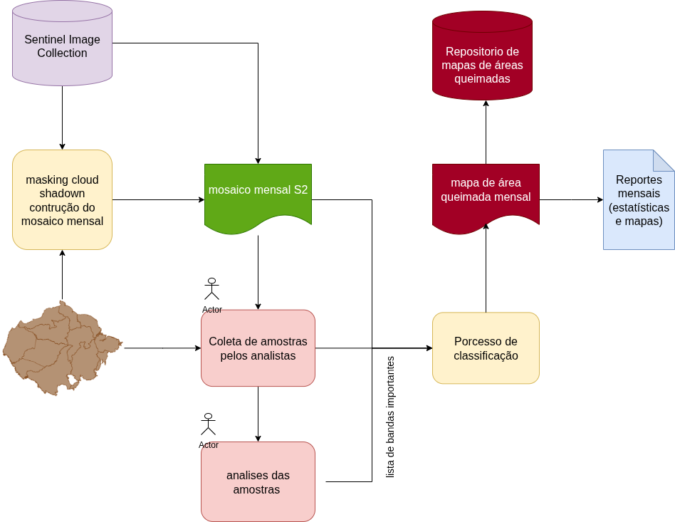
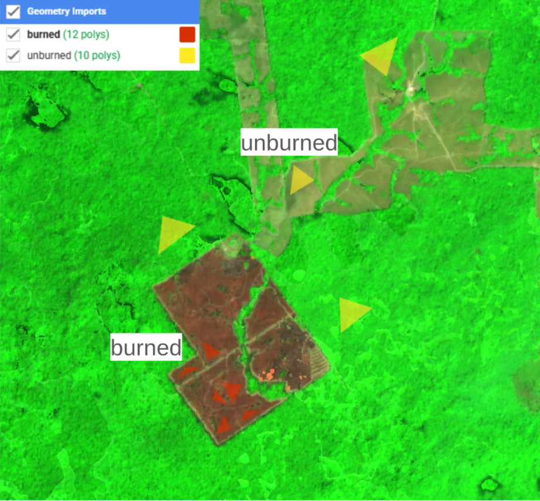

# Mapeamento de Áreas Queimadas na Pan-Amazônia com Google Earth Engine

## 🎯 Sobre o Projeto

Este projeto tem como objetivo desenvolver e implementar um fluxo de trabalho completo para o mapeamento e análise de áreas queimadas na região Pan-Amazônica. Utilizando o poder do Google Earth Engine (GEE), o processo abrange desde o pré-processamento de dados de satélite até a classificação final e a análise de amostras, permitindo uma avaliação precisa e eficiente das cicatrizes de incêndio.

O fluxo de trabalho é dividido em quatro etapas principais: pré-processamento, coleta de amostras, análise das amostras e classificação.

## 🗺️ Área de Estudo e Divisão Regional

Para otimizar o processamento e a análise por especialistas, a vasta área da Pan-Amazônia foi subdividida em regiões específicas de trabalho, conforme ilustrado abaixo. Esta abordagem permite a distribuição de tarefas e uma análise mais focada em cada localidade.

*

  

*
> **Nota:** Substitua `URL_DA_SUA_IMAGEM_1_AQUI` pelo link da sua Imagem 1.

## ⚙️ Fluxo de Processamento

O processo completo, desde a preparação dos dados até a geração do mapa final, segue o fluxo de trabalho detalhado abaixo.

### 1. Pré-processamento dos Dados

A primeira etapa consiste na preparação dos dados brutos e na definição das áreas de interesse para a análise.
- **Definição de Novos Limites:** Ajuste e definição dos limites geográficos para a análise.
- **Divisão de Tarefas:** Estruturação das áreas para dividir as tarefas de coleta e análise entre os especialistas de cada região.

### 2. Scripts de Coleta de Amostras

Esta fase foca na criação de mosaicos de imagens e na extração de informações espectrais para a coleta de amostras de treinamento (ROIs - Regiões de Interesse).
- **Máscara de Nuvens:** Aplicação de algoritmos para remover pixels contaminados por nuvens e sombras.
- **Mosaico Mensal:** Criação de um mosaico de imagens de satélite com a melhor composição de pixels para cada mês.
- **Cálculo de Índices Espectrais:** Geração de índices como NDVI, NBR, etc., para realçar feições de interesse.
- **Integração de Alertas de Fogo (NOAA/SNPP):** Adição de camadas de focos de calor para auxiliar na identificação de áreas queimadas no respectivo mês.
- **Coleta de Amostras:** Adição das `FeatureCollections` que contêm os polígonos de treinamento (amostras de áreas queimadas e não queimadas).
- **Exportação de ROIs:** Extração e exportação das amostras com seus respectivos rótulos e informações espectrais.

### 3. Análise de Amostras e *Feature Space*

Com as amostras coletadas, esta etapa realiza uma análise exploratória para entender a distribuição espectral das classes e selecionar as melhores variáveis para o modelo de classificação.
- **Análise em Google Colab:** Utilização de scripts em ambiente Colab para a análise estatística e visual das amostras.
- **Seleção de Bandas (*Feature Importance*):** Aplicação de métodos, como *Random Forest Feature Importance*, para identificar e selecionar as bandas e índices mais relevantes para a classificação.

### 4. Classificação e Visualização

A etapa final utiliza as amostras e as bandas selecionadas para treinar um classificador e gerar o mapa final de áreas queimadas.
- **Carregar Amostras:** Importação das amostras de treinamento para o ambiente GEE.
- **Definir Bandas:** Seleção das bandas e índices definidos como importantes na etapa anterior.
- **Definir Parâmetros do Classificador:** Configuração do algoritmo de classificação (ex: Random Forest), ajustando seus hiperparâmetros.
- **Classificar o Mosaico:** Execução do modelo para classificar todo o mosaico de imagens.
- **Visualizar o Resultado:** Apresentação da camada final com as áreas queimadas classificadas.

---

### Diagrama do Fluxo de Trabalho

O fluxograma abaixo resume visualmente todas as etapas do processo.

*

  

*

## 🔗 Scripts no Google Earth Engine

Os scripts para cada uma das etapas principais do processo estão disponíveis nos links abaixo.

* **Scripts de Coleta de Amostras:**
    * [Acessar Script no GEE](https://code.earthengine.google.com/b6599fcae20c305d66b46fcf8f6cb558)
    * O processo de coletas deve mudar no scripts as linhas 50 e 51 do código
        ** var analista_activo = 'rafaela';
        ** var region = '5';
    * As amostras devem ser coletadas como o exemplo siguente, e antes selecionar os poligonos burned ou unburned para coletar
    *

        
    
*

* **Script de Análise de Amostras e *Feature Importance*:**
    * [Acessar Script no colab googl](https://colab.research.google.com/drive/1d9CIyDg6UrvVqXgfzq9dl3WbK5tZmqB9?usp=sharing)

* **Scripts de Classificação e Visualização:**
    * [Acessar Script no GEE](https://code.earthengine.google.com/e50b7ddc946fe7f4d0554d5f0eef40de)